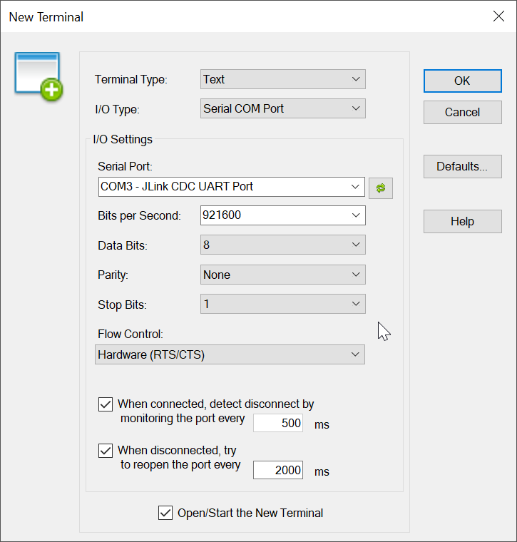
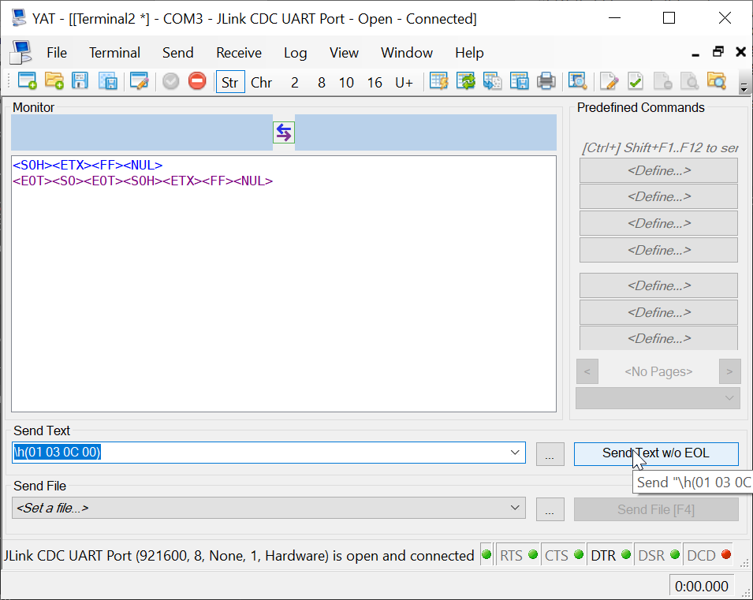
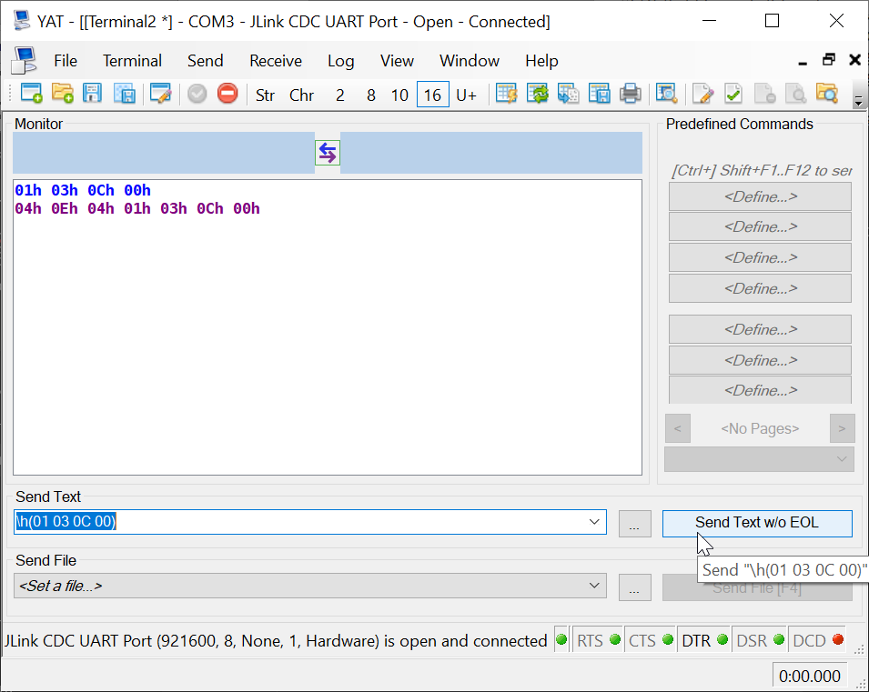

## Testing your RCP is working

  1.  Launch YAT and open a new terminal from the File menu for your kit with the correct UART settings

  2. Once the terminal is openned, you can type a command in hex format, that's a particularity to YAT!
     we will enter the HCI reset command which is "01 03 0C 00" using \h(01 03 0C 00)
     note that you can also display the exchange in different format. I show below the display in ASCII and in Hexadecimal.

  
  

  3. If you get a response like shown above, then you succefully tested your RCP.
     If you don't get a response, there are some checkings to be done:
       - have you flashed a bootloader?
       - have you flashed the RCP image?
       - Are the settings of the UART aligned between the RCP image, the kit interface and the terminal?