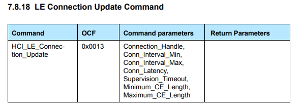
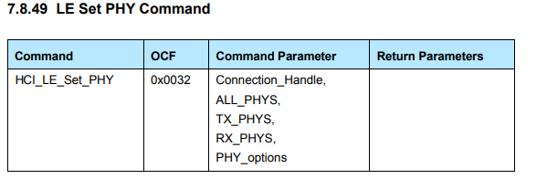

## Using Bluez + RCP to interact with **SoC Throughput (with display)** example application

Once your RCP is built and flashed, you have to attach it to your linux machine with the following command:

```bash
btattach -B /dev/ttyUSBx -S 921600 
```
or 

```bash
hciattach -s 921600 /dev/ttyUSBx any noflow nosleep 
```

In the above example, 921600 is the baudrate of the serial link. This command will add a new HCI interface to your machine. You can retrieve HCI index with the following command:

```bash
hciconfig -a
```

In this document, we are going to use hci0 as BLE interface. ID of Ble peripheral running SoC Throughput application is D0:CF:5E:68:AA:6A

Once the RCP is attached to your linux machine, follow this procedure to test throughput:

### Reset the BLE controller (RCP) 

```bash
sudo hciconfig hci0 reset
```

### Start **bluetoothctl**

```bash
bluetoothctl
```
The following command are run in bluetoothctl tool:

### Remove any cache information about the node you want to connect to (this only apply if a connection was previously done)

```bash
remove D0:CF:5E:68:AA:6A
```

### Scan until you detect your SoC Throughput peripheral then stop scanning

```bash
scan le
scan off
```

### Connect to the target

```bash
connect D0:CF:5E:68:AA:6A
```

### Exit **bluetoothctl**

```bash
exit
```

### Update connection parameters

At this point connection is established. Follow [this guide](https://docs.silabs.com/bluetooth/4.0/general/system-and-performance/throughput-with-bluetooth-low-energy-technology) to have an overview of the different thoughput values that can be obtained depending on configuration (Indication vs Notification, PHY used, Maximum PDU, ...)

If you are testiing notification (highest throughput), an important point here is to update connection parameters if you want to reach the best throughput. To get the best throughput it is necessary to adjust the connection event length (minimum and maximum CE lenght) to send the maximum number of packet during one connection interval.



To modify connection parameters, you can use the following command:

```bash
sudo hcitool cmd 08 13 00 00 07 00 08 00 0a 00 2F 00 0f 00 10 00
```
In the above command
- Connection Interval (CI) min is set to 7 (0x0007) and CI max is set to 8 (0x0008). Connection interval time = CI * 1.25 ms
- Connection Event (CE) length min is set to 15 (0x000F) and CE length max is set to 16 (0x0010). Connection event time = CE * 0.625 ms

It is also possible to change the PHY to one of the following PHY introduced by bluetooth 5:

- 2 Mbps
- 1 Mbps.
- 500 kbps (1 Mbps with 1:2 convolution coding)
- 125 kbps (1 Mbps with 1:8 convolution coding)




This can be done with the following command:

```bash
sudo hcitool cmd 08 32 00 00 01 01
```

### Subscribe to characteristics and start the test

Once you connection parameters are updated you need to launch again bluetoothctl to continue the test.

```bash
bluetoothctl
menu gatt
select-attribute adf32227-b00f-400c-9eeb-b903a6cc291b
notify on
select-attribute 47b73dd6-dee3-4da1-9be0-f5c539a9a4be
notify on
select-attribute be6b6be1-cd8a-4106-9181-5ffe2bc67718
notify on
write 1
```
### Finally stop the test after some time and exit bluetoothctl

```bash
write 0
exit
```

### Get throughput result value in the console of SoC Throughput application


### Scripting the procedure

This test involves a lot of command. However it is possible to use [coproc command](https://www.gnu.org/software/bash/manual/html_node/Coprocesses.html) in a script to automates the test procedure. This is an example of bash script that automate previous procedure:

```bash
#!/bin/bash

sudo hciconfig hci0 reset
coproc bluetoothctl

echo -e 'remove D0:CF:5E:68:AA:6A\n' >&${COPROC[1]}
sleep 1
echo -e 'scan le\n' >&${COPROC[1]}
sleep 3
echo -e 'scan off\n' >&${COPROC[1]}
sleep 1
echo -e 'connect D0:CF:5E:68:AA:6A\n' >&${COPROC[1]}
sleep 3
echo -e 'exit\n' >&${COPROC[1]}
output=$(cat <&${COPROC[0]})
echo $output

#PHY 1M
sudo hcitool cmd 08 32 00 00 01 01
sudo hcitool cmd 08 13 00 00 07 00 08 00 0a 00 2F 00 0f 00 10 00

coproc bluetoothctl

echo -e 'menu gatt\n' >&${COPROC[1]}
echo -e 'select-attribute adf32227-b00f-400c-9eeb-b903a6cc291b\n' >&${COPROC[1]}
echo -e 'notify on\n' >&${COPROC[1]}
echo -e 'select-attribute 47b73dd6-dee3-4da1-9be0-f5c539a9a4be\n' >&${COPROC[1]}
echo -e 'notify on\n' >&${COPROC[1]}
echo -e 'select-attribute be6b6be1-cd8a-4106-9181-5ffe2bc67718\n' >&${COPROC[1]}
echo -e 'notify on\n' >&${COPROC[1]}
echo -e 'write 1\n' >&${COPROC[1]}
sleep 20
echo -e 'write 0\n' >&${COPROC[1]}
sleep 4
echo -e 'exit\n' >&${COPROC[1]}
output=$(cat <&${COPROC[0]})
echo $output
```


