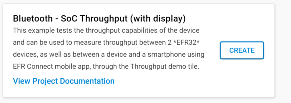
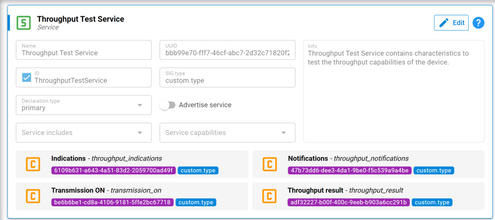

# Testing RCP throughput

##  Create Bluetooth - SoC Throughput (with display) application

One method to evaluate throughput of Bluez + RCP is to create a BLE connection between RCP and our **SoC Throughput (with display)** example application.
Throughput will be evaluated by receiving notification or indication from the server (SOC throughput application) to the client (Bluez + RCP)

Follow [this guide]({{ site.github.url }}/Bluetooth/RCP_HCI/Basic_rcp_test) to prepare a BLE Radio Co-Processor (RCP)

The **SoC Throughput (with display)** application example is available in SimplicityStudio5. Compile and flash this example on an EFR32. Please verify that selected EFR32 supports the PHY that you would like to evaluate

Gatt of this application has a throughput test service with 4 characteristics as you can see on the following picture. 
These characteristics will be manipulated later by Bluez to run the throughput test.

To run throughput test, the client (here Bluez + RCP) have first to subscribe to several characteristics:

- The **Throughput result** characteristic (adf32227-b00f-400c-9eeb-b903a6cc291b)
- The **Transmission ON** characteristic (be6b6be1-cd8a-4106-9181-5ffe2bc67718)

It must also subcribe either to notification or indication depending on the type of test you want to run:

- The **Notifications** characteristics (47b73dd6-dee3-4da1-9be0-f5c539a9a4be)
- The **Indications** characteristics (6109b631-a643-4a51-83d2-2059700ad49f)

After subscription, client have to write 1 to the **Transmission ON characteristic** (be6b6be1-cd8a-4106-9181-5ffe2bc67718) to start the test.

After several second, client can stop the test by writing 0 to the **Transmission ON characteristic** (be6b6be1-cd8a-4106-9181-5ffe2bc67718).

Throughput result value will be displayed in the console of SoC Throughput application:

